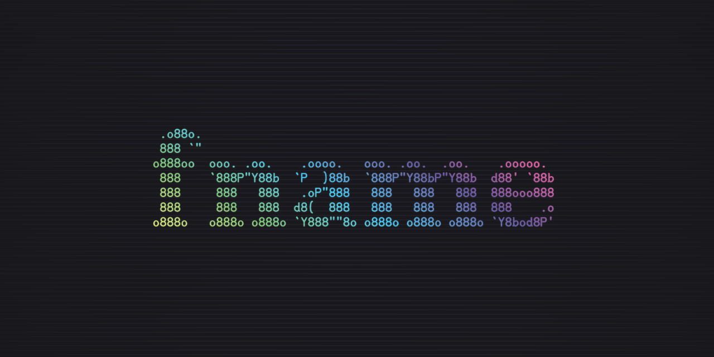

# fname

Generate random, human-friendly names, like `determined-pancake` or `sinister discovery`. `fname` is like a grammatically aware diceware generator for unique names or identifiers.

`fname` isn't meant to provide a secure, globally unique identifier, but with over 500 billion possible combinations, it's good enough for most non-critical use cases.

## Installation

### Download

Download the latest release from the [releases page](https://github.com/Splode/fname/releases).

### Go

```sh
go install github.com/splode/fname/cmd/fname@latest
```

### Source

```sh
git clone https://github.com/splode/fname.git
cd fname
go install ./cmd/fname
```

## Usage

### CLI
  
Generate a single, random name phrase:

```sh
$ fname
extinct-green
```

Generate multiple name phrases, passing the number of names as an argument:

```sh
$ fname --quantity 3
influential-length
direct-ear
cultural-storage
```

Generate a name phrase with a custom delimiter:

```sh
$ fname --delimiter "__"
glaring__perception
```

Generate a name phrase with more words:

```sh
$ fname --size 3
vengeful-toy-identified

$ fname --size 4
spellbinding-project-presented-fully
```

Note: the minimum phrase size is 2 (default), and the maximum is 4.

Specify the seed for generating names:

```sh
$ fname --seed 123 --quantity 2
pleasant-joy
eligible-tenant

$ fname --seed 123 --quantity 2
pleasant-joy
eligible-tenant
```

### Library

#### Install

```sh
go get github.com/splode/fname
```

#### Basic Usage

```go
package main

import (
  "fmt"

  "github.com/splode/fname"
)

func main() {
  rng := fname.NewGenerator()
  phrase, err := rng.Generate()
  fmt.Println(phrase)
  // => "influential-length"
}
```

#### Customization

```go
package main

import (
  "fmt"

  "github.com/splode/fname"
)

func main() {
  rng := fname.NewGenerator(fname.WithDelimiter("__"), fname.WithSize(3))
  phrase, err := rng.Generate()
  fmt.Println(phrase)
  // => "established__shark__destroyed"
}
```

## License

[MIT License](./LICENSE)

## Related Projects

- [go-diceware](https://github.com/sethvargo/go-diceware)
- [wordnet-random-name](https://github.com/kohsuke/wordnet-random-name)
